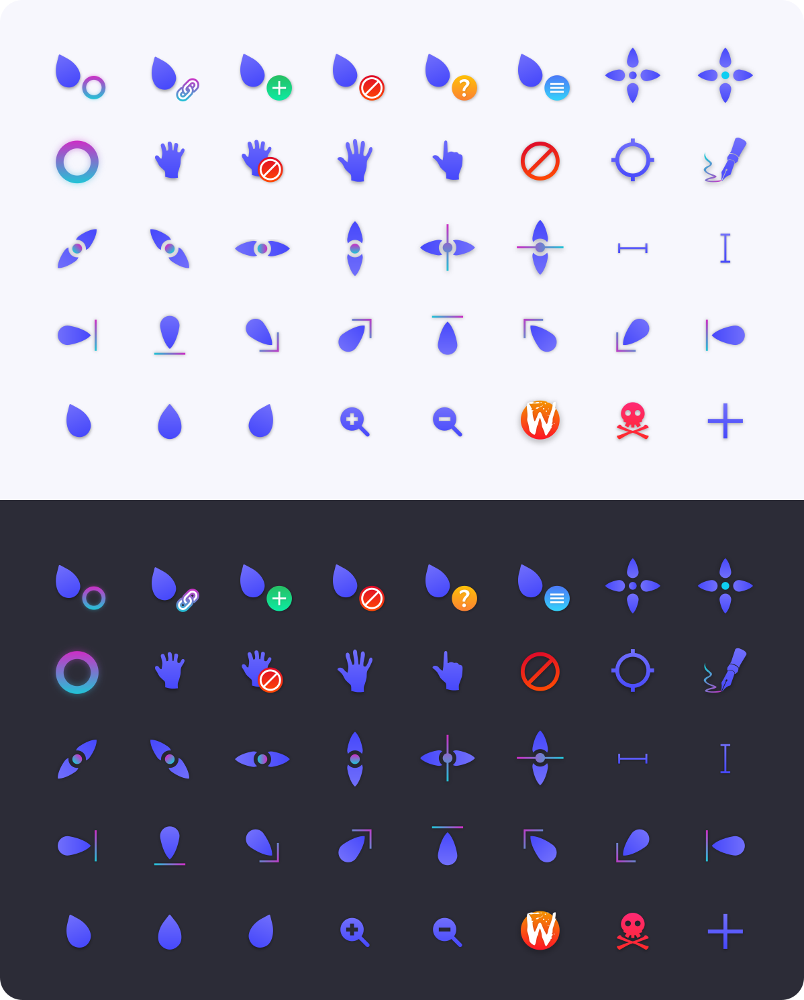
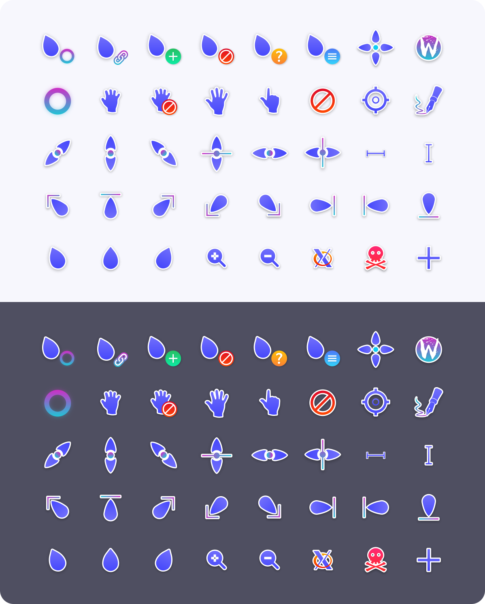
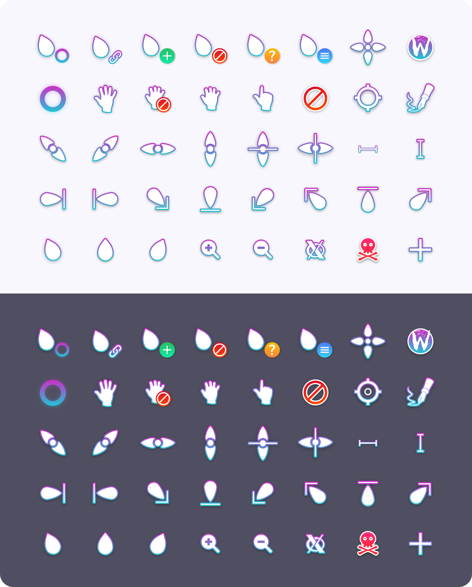

# Layan cursors
This is an x-cursor theme inspired by layan gtk theme and
based on [capitaine-cursors](https://github.com/keeferrourke/capitaine-cursors).

## Windows Version
You can get the original Layan Cursors Windows port here - [Layan-Cursors-for-windows](https://github.com/emaxoda/Layan-cursors-for-Windows)

You can get the Layan Cursors bordered version for Windows here - [Layan Bordered White Cursors for Windows](https://github.com/RandomPenguin1778/Layan-White-Cursors-Windows-Port)

## Installation
To install the cursor theme simply copy the compiled theme to your icons
directory. For local user installation:

```
./install.sh
```

For system-wide installation for all users:

```
sudo ./install.sh
```

Then set the theme with your preferred desktop tools.

## Building from source
You'll find everything you need to build and modify this cursor set in
the `src/` directory. To build the xcursor theme from the SVG source
run:

```
./build.sh
```

This will generate the pixmaps and appropriate aliases.
The freshly compiled cursor theme will be located in `dist/`

## Preview



